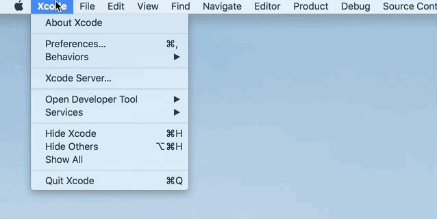

# tools

## xcode-clang-format.applescript

This is an osascript that can use `clang-format `to format a selection in xcode

### Installation

Install [Homebrew](https://brew.sh/):

```
/usr/bin/ruby -e "$(curl -fsSL \
    https://raw.githubusercontent.com/Homebrew/install/master/install)"
```

Install [`clang-format`](https://clang.llvm.org/docs/ClangFormat.html):

```
brew install clang-format
```

Clone this repository:

```
cd <where-you-want-it>
git clone https://github.com/sean-parent/tools.git tools
```

Make the scripte executable:

```
chmod +x ./tools/xcode-clang-format.applescript
```

Add it as a behavior to Xcode:




You can add a command-key shortcut directly in Xcode or there is more flexibility if you add a shortcut through the keyboard system preferences (for example, I use f1 as my shortcut key).

## Usage

* The script uses the `-style=file` option for `clang-format`. It will find a `.clang-format` or `_clang-format` file in the same directy or any parent directory of the file you are formatting. Make sure you have an appropriate format file in place.
* Make sure you only have one tab open on the document you wish to format
* Make sure you have saved the file
* Select an area of text you wish to format
* Select the `clang-format` behavior

Only the selected area is formatted.


